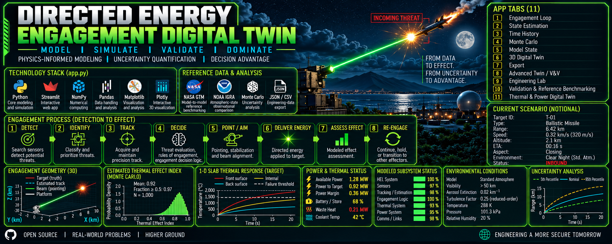

  

# Directed Energy Engagement Digital Twin

### Physics-Informed Aerospace Simulation | Digital Engineering | Autonomy | State Estimation | Uncertainty Quantification | V&V

The **Directed Energy Engagement Digital Twin** is a Python-based aerospace digital engineering application for modeling, simulating, visualizing, and evaluating a complex closed-loop engagement system.

Built with **Python, Streamlit, NumPy, Pandas, Matplotlib, and Plotly**, the application integrates aerospace dynamics, sensor/state estimation, atmospheric modeling, beam propagation, power and thermal behavior, Monte Carlo uncertainty analysis, requirements traceability, verification, and reference benchmarking within a single interactive environment.

The project demonstrates how physics-informed simulation and systems engineering can be integrated into a lightweight software architecture to support rapid engineering analysis and decision-making.

> **Model. Simulate. Validate. Dominate.**

---

## Why This Project Matters

Modern aerospace and autonomous systems increasingly depend on the ability to connect **models, sensor information, uncertainty, system constraints, requirements, and engineering decisions**.

This application explores that problem as an integrated digital twin.

Rather than treating trajectory modeling, tracking, thermal analysis, power management, uncertainty analysis, and verification as isolated calculations, the application connects them into a common engineering workflow:

**Sense → Estimate → Decide → Act → Assess → Re-engage**

That architecture is directly relevant to engineering problems involving:

- autonomous and uncrewed aircraft systems
- aerospace digital twins
- mission and engagement simulation
- guidance, navigation, and control
- sensor fusion and state estimation
- tracking and decision-support systems
- model-based systems engineering
- power and thermal management
- uncertainty quantification
- simulation-based verification and validation
- resilient autonomous systems

The directed-energy scenario provides a demanding systems problem through which these capabilities can be developed and demonstrated.

---

## Engineering Value

The principal value of the project is not a single equation or visualization. It is the **integration of multiple engineering domains into one traceable computational environment**.

A change in environment, target state, sensor performance, pointing uncertainty, available power, or thermal condition can propagate through the model and affect downstream system behavior and decision-support outputs.

This provides a foundation for engineering activities such as:

- architecture and concept evaluation
- requirements analysis
- trade studies
- sensitivity analysis
- uncertainty characterization
- model verification
- reference benchmarking
- subsystem interaction analysis
- digital engineering experimentation
- rapid prototyping of autonomy and decision-support concepts

The same software architecture can be adapted to other aerospace and autonomous-system problems where sensing, physics, resource constraints, uncertainty, and decision logic interact.

---

## Closed-Loop Engagement Architecture

The application models an eight-stage closed-loop process:

1. **Detect** – Search sensors identify a potential target.
2. **Identify** – Measurements support classification and prioritization.
3. **Track** – State estimation maintains a continuously updated target track.
4. **Decide** – Engagement logic evaluates geometry, timing, system state, and constraints.
5. **Point / Aim** – Beam geometry and pointing uncertainty are evaluated.
6. **Deliver Energy** – Available power, atmospheric transmission, and beam spreading determine delivered energy.
7. **Assess Effect** – Reduced-order thermal response and engineering effect metrics are evaluated.
8. **Re-engage** – Updated system state feeds the next decision cycle.

This closed-loop structure provides a compact example of the **sense–estimate–decide–act–assess** architectures common to autonomous aerospace systems.

---

## Core Technical Capabilities

### Aerospace Dynamics

The application includes both **3-DOF kinematic** and **generic 6-DOF rigid-body** modeling capabilities.

The higher-order aerospace model incorporates:

- translational dynamics
- rigid-body rotational dynamics
- quaternion attitude representation
- coordinate-frame transformations
- trajectory propagation
- body forces and moments
- reduced-order aerodynamic effects

NASA Generic Transport Model data can be used for **model-to-model flight-dynamics reference benchmarking**.

The aerospace models are intentionally generic and reduced-order rather than representations of a specific operational vehicle.

### State Estimation and Tracking

The application implements measurement-driven state estimation and tracking using Kalman-filter methods.

Engineering outputs include:

- estimated target state
- covariance
- residuals
- track-quality metrics
- line-of-sight geometry
- angular uncertainty
- closest-point-of-approach calculations
- NEES/NIS consistency diagnostics

This portion of the project is particularly applicable to **autonomous navigation, sensor fusion, target tracking, robotics, and UAS perception pipelines**.

### Atmospheric Modeling

Environmental modeling includes:

- standard-atmosphere relationships
- visibility-dependent aerosol extinction
- Rayleigh scaling
- humidity effects
- reduced-order atmospheric transmission
- configurable turbulence/spreading effects

NOAA IGRA radiosonde observations provide an independent source for **atmospheric-state comparison**.

IGRA data are not presented as validation of optical propagation.

### Beam and Pointing Model

The reduced-order optical model evaluates:

- diffraction
- additional optical spreading
- reduced-order turbulence effects
- pointing uncertainty
- atmospheric transmission
- spot size
- target irradiance
- delivered optical power

The model is designed for engineering analysis and sensitivity studies rather than high-fidelity wave-optics prediction.

### Power and Thermal Digital Twin

The application couples engagement behavior to finite system resources.

Modeled quantities include:

- electrical input
- optical output
- conversion losses
- stored energy
- generator contribution
- cooling capacity
- waste heat
- coolant temperature
- thermal margin

An optional **Thermal & Power Digital Twin** extends the analysis with a generic multi-node thermal network and a transient **1-D Fourier conduction model**.

This enables investigation of an important aerospace systems problem:

**Can the system perform the mission while remaining inside its power and thermal constraints?**

### Monte Carlo Uncertainty Quantification

Monte Carlo simulation propagates uncertainty through the modeled system.

The analysis supports:

- configurable trials
- uncertain input sampling
- output distributions
- percentiles
- sensitivity analysis
- threshold exceedance statistics
- uncertainty-informed engineering decisions

The application reports an **Estimated Thermal Effect Index** as an engineering indicator. It is not represented as a validated probability of kill or calibrated probability of physical damage.

### 3-D Digital Twin

The interactive 3-D environment visualizes:

- target trajectories
- moving-platform state
- measurement reconstruction
- engagement geometry
- beam pointing
- line-of-sight relationships
- intercept geometry

This connects numerical model state with an intuitive spatial representation of the simulated system.

---

## Systems Engineering and Digital Engineering

The application includes an **Engineering Lab** designed to connect simulation results with systems-engineering artifacts.

Capabilities include:

- stakeholder-need registry
- system requirements
- requirement evaluation
- requirements traceability
- verification methods
- verification evidence
- trade studies
- model provenance
- regression checks
- engineering-data export

The current model includes a defined engineering baseline and checks whether requirement traceability identifiers resolve to registered needs and system requirements.

This creates a lightweight bridge between **model-based analysis and requirements-driven systems engineering**.

---

## Verification, Validation, and Reference Benchmarking

The project deliberately distinguishes **verification** from **validation**.

### Verification

Verification activities include:

- numerical convergence checks
- regression testing
- covariance consistency checks
- conservation and invariant checks
- model sanity checks
- traceability checks

### Reference Benchmarking

The generic aerospace model can be compared with **NASA Generic Transport Model (GTM)** reference data.

This is treated as **model-to-model reference benchmarking**, not empirical flight-test validation of the application.

### Atmospheric Comparison

**NOAA IGRA** radiosonde observations provide independent atmospheric-state data for comparison with modeled atmospheric conditions.

This comparison applies only to the atmospheric variables evaluated and does not constitute empirical validation of the directed-energy propagation or target-effect models.

---

## Application Modules

The Streamlit interface currently contains eleven primary engineering workspaces:

| Module | Purpose |
|---|---|
| Engagement Loop | Closed-loop engagement analysis |
| State Estimation | Tracking and estimator diagnostics |
| Time History | Dynamic simulation outputs |
| Monte Carlo | Uncertainty quantification |
| Model State | Internal model-state inspection |
| 3D Digital Twin | Spatial visualization |
| Export | Engineering-data export |
| Advanced Twin / V&V | Higher-order aerospace modeling and verification |
| Engineering Lab | Requirements, trades, provenance, and regression |
| Validation & Reference Benchmarking | NASA GTM and NOAA IGRA comparisons |
| Thermal & Power Digital Twin | Component thermal and power analysis |

---

## Technology Stack

| Technology | Role |
|---|---|
| **Python** | Core modeling and application logic |
| **Streamlit** | Interactive engineering interface |
| **NumPy** | Numerical computation |
| **Pandas** | Engineering-data handling |
| **Matplotlib** | Scientific visualization |
| **Plotly** | Interactive 2-D/3-D visualization |
| **NASA GTM** | Flight-dynamics reference benchmarking |
| **NOAA IGRA** | Atmospheric-state observational comparison |
| **JSON / CSV** | Portable engineering-data export |

---

## Relevance to Aerospace, Autonomy, AI, and UAS

Although the demonstrator uses a directed-energy engagement scenario, the underlying engineering patterns are broader.

The architecture can be generalized to applications such as:

- autonomous UAS mission simulation
- GNSS-denied navigation
- multi-sensor tracking
- detect-and-avoid systems
- autonomous mission management
- spacecraft proximity operations
- robotic inspection
- planetary surface autonomy
- resilient navigation
- sensor-resource management
- predictive vehicle health
- power-aware mission planning
- digital-twin-based decision support

Many of these systems share the same fundamental computational problem:

**Estimate the state of a dynamic environment, propagate physical models, quantify uncertainty, enforce system constraints, and convert the result into an actionable decision.**

---

## AI and Autonomous Systems Direction

The current application is intentionally **physics-informed rather than AI-dependent**.

That distinction is important.

Physics-based models provide interpretable system behavior and explicit engineering constraints. AI/ML can then be incorporated where it provides measurable value, including:

- perception and classification
- anomaly detection
- surrogate modeling
- adaptive parameter estimation
- predictive maintenance
- mission planning
- intelligent decision support
- natural-language interaction with engineering models

A particularly promising architecture is therefore:

**Physics-Based Digital Twin + State Estimation + Uncertainty Quantification + AI Decision Support**

This allows machine intelligence to operate against a structured engineering model rather than functioning as an opaque replacement for the underlying physics.

---

## Potential Industry Applications

The architecture demonstrates concepts relevant to organizations developing:

**Aerospace systems**  
Digital twins, flight simulation, mission engineering, GNC, modeling and simulation, V&V, and multidisciplinary engineering analysis.

**Uncrewed and autonomous systems**  
UAS autonomy, sensor fusion, navigation, tracking, mission management, and autonomous decision architectures.

**Defense technology**  
Mission simulation, tracking, resource allocation, decision support, uncertainty analysis, and digital engineering.

**AI-enabled engineering**  
Physics-informed AI, engineering copilots, surrogate models, intelligent model interrogation, and AI-assisted systems engineering.

**Robotics**  
State estimation, sensor fusion, closed-loop autonomy, resource management, and environment-aware decision making.

---

## Engineering Scope and Limitations

This repository is a **physics-informed, reduced-order digital engineering and research prototype**.

It is not:

- a validated operational weapon model
- a high-fidelity missile simulation
- a lethality model
- a probability-of-kill model
- a substitute for hardware testing
- an operational fire-control system

Aerodynamics, atmospheric propagation, beam behavior, thermal response, power behavior, and subsystem interactions use deliberately reduced-order representations suitable for engineering exploration.

Results should therefore be interpreted as **scenario-dependent engineering outputs**, not predictions of real-world operational performance.

---

## What This Project Demonstrates

From a software and engineering perspective, this repository demonstrates practical experience with:

**Python engineering software development • aerospace modeling and simulation • digital twins • state estimation • Kalman filtering • 3-DOF/6-DOF dynamics • coordinate transformations • Monte Carlo analysis • uncertainty quantification • thermal modeling • power-system modeling • requirements traceability • verification and validation • scientific visualization • interactive application development • systems engineering • autonomous-system architectures**

---

## Repository Purpose

This project is part of an ongoing effort to explore how **aerospace physics, autonomous systems, digital engineering, systems engineering, and AI-enabled analysis** can be brought together in lightweight, accessible engineering software.

The broader objective is to develop tools that shorten the path from:

**Requirements → Models → Simulation → Evidence → Engineering Decision**

while maintaining explicit assumptions, traceability, uncertainty awareness, and human engineering judgment.

---

### Model. Simulate. Validate. Dominate.

*Physics-informed engineering for complex autonomous and aerospace systems.*
